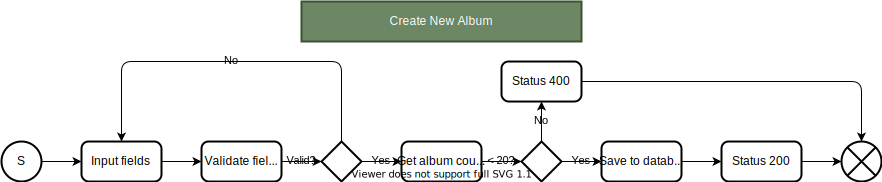
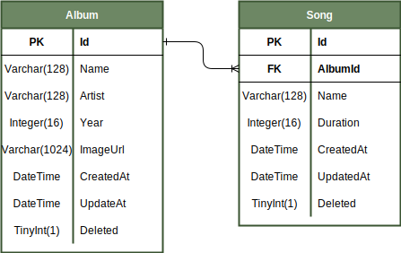

# Musicfy BackEnd - Dynamic Devs Assessment

**Candidate:** Juan Pablo Beltran Flores <br>
**Date:** November 21th, 2022

## 1. Assessment problem

Musicfy needs a module to manage albums for their streaming platform. Create a solution that allows Musicfy to manage albums for their streaming platform. As a plus, Musicfy also needs to manage Songs.

**Technical Constraints:**

* The solution has to be implemented on Node.js using either Nest or Express.
* Use a database ORM such as Sequelize.
* Do not use Store Procedures or native queries.

**Design Constraints:**

* CRUD operations for Albums and Songs.
* Only a maximum of 20 albums can be stored at the same time.
* An album only have name, artist name, year and image URL. The year can only be between 2010 to 2021.

## 2. Implementation of solution

### a. Flowchart Diagram

Before coding, it is important to understand the problem. With the problem well defined, the next step was create a Flowchart which describes the behavior of the program when creating a new album.



This is the only Flowchart since it is the main functionality of the program. After we understand perfectly the problem and solution, we should start working on identifying the problem identities.

### a. Entity Relationship Diagram

We have identified two main entities on the Musicfy streaming platform. These two entities are the ```Albums``` and ```Song``` entities. An album can contain many songs, but a song can only be part of one album.



Finally, once we have defined our Entity Relationship Diagram, we can start thinking about the architecture design for the program.

### c. Architecture Design

For the solution, a Clean Architecture pattern will be used. This will be composed of 6 layers, where the inner layer does not depends on the outer layer as seen on the following diagram.


This diagram represents the following order of the layers: **Infraestructure > Application > Routes > Controllers > Business Access Layer > Data Access Layer**.

## 3. Run the application manually

The first step is create a ```.env``` file on the ```musicfy-backend``` folder. The following information should be on the dotenv file.

```
NODE_ENV = development
PORT = 8080

DB_USERNAME = database username
DB_PASSWORD = database password
DB_DATABASE = database name
DB_HOST = localhost
DB_PORT = database port
DB_DIALECT = database dialect

```
Then run the following commands on a terminal inside the ```musicfy-backend``` folder.
```
    npm install
    npm run start
```
If the application is correctly started, the following dialogs should be shown within the terminal.

```
    Listening on port 8080
    Database synchronized
```

## 4. Endpoints

### a. Albums

**1. Get all the albums**

```
    @routes  GET /album/get
    @descri  Gets all the active albums from the database
    @params  {Id}: Album Id
    @access  Public
```

**2. Create a new album**

```
    @routes  POST /album/create
    @descri  Creates a new album
    @params  None
    @access  Public
```

**3. Get an album by Id**

```
    @routes  GET /album/get/:id
    @descri  Gets a single album by id
    @params  {Id}: Album Id
    @access  Public
```

**4. Edit an album**

```
    @routes  PUT /album/edit/:id
    @descri  Updates the fields of the album
    @params  {Id}: Album Id
    @access  Public
```

**5. Delete an album**

```
    @routes  PUT /album/delete/:id
    @descri  Updates the Deleted field to true
    @params  {Id}: Album Id
    @access  Public
```

### b. Songs

**1. Get all the songs from an album**

```
    @routes  GET /song/get/:albumId
    @descri  Gets all songs from an album
    @params  {albumId}: Album Id
    @access  Public
```

**2. Create a new song**

```
    @routes  POST /create/:albumId
    @descri  Creates a new song
    @params  {albumId}: Album Id
    @access  Public
```

**3. Update a song**

```
    @routes  PUT /song/edit/:id
    @descri  Updates the fields of the song
    @params  {Id}: Song Id
    @access  Public
```

**4. Delete a song**

```
    @routes  PUT /song/delete/:id
    @descri  Updates the Deleted field to true
    @params  {Id}: Song Id
    @access  Public
```